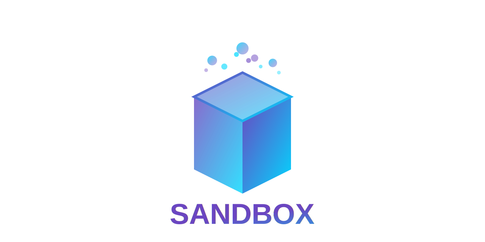
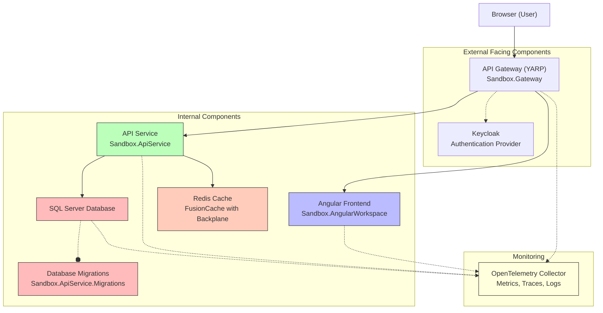
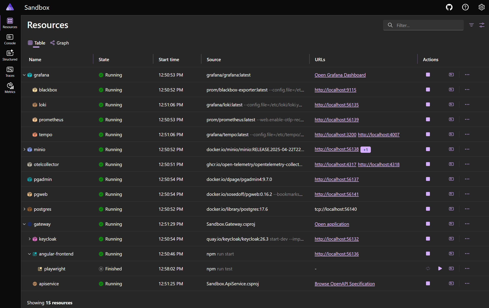
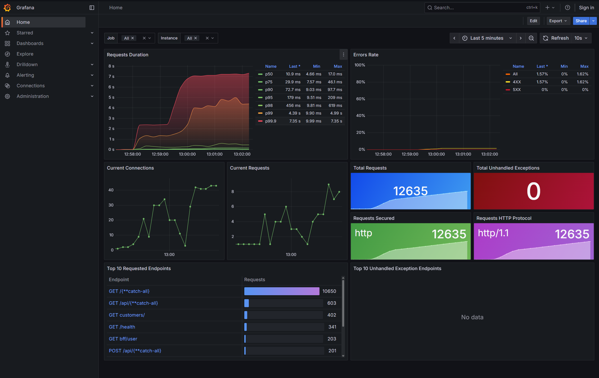
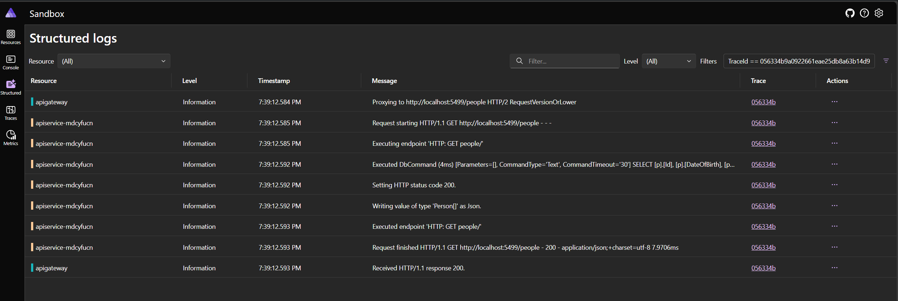
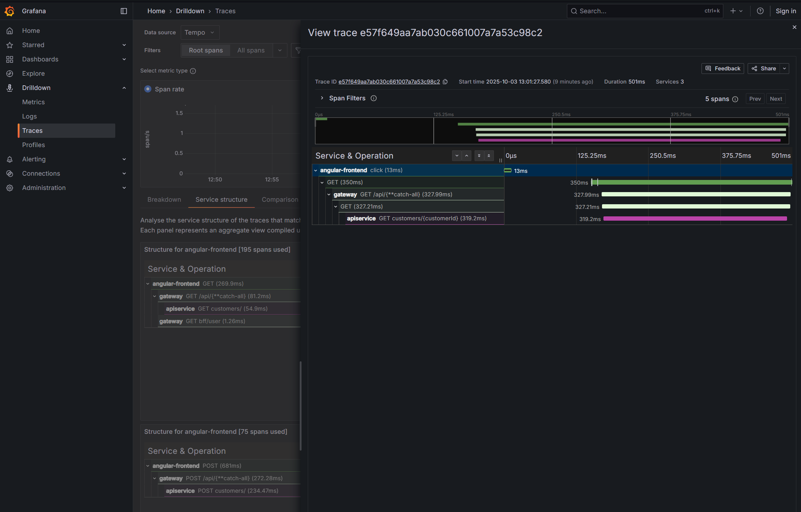
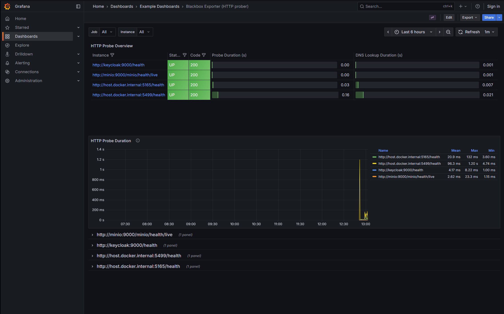
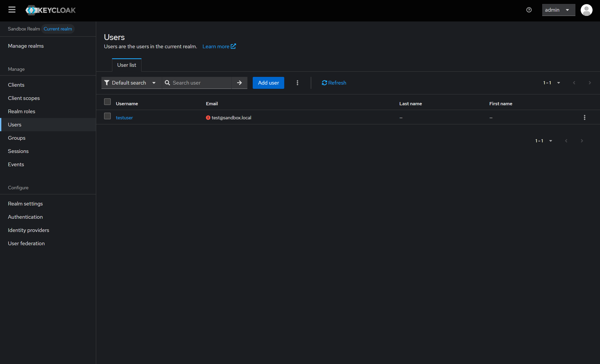
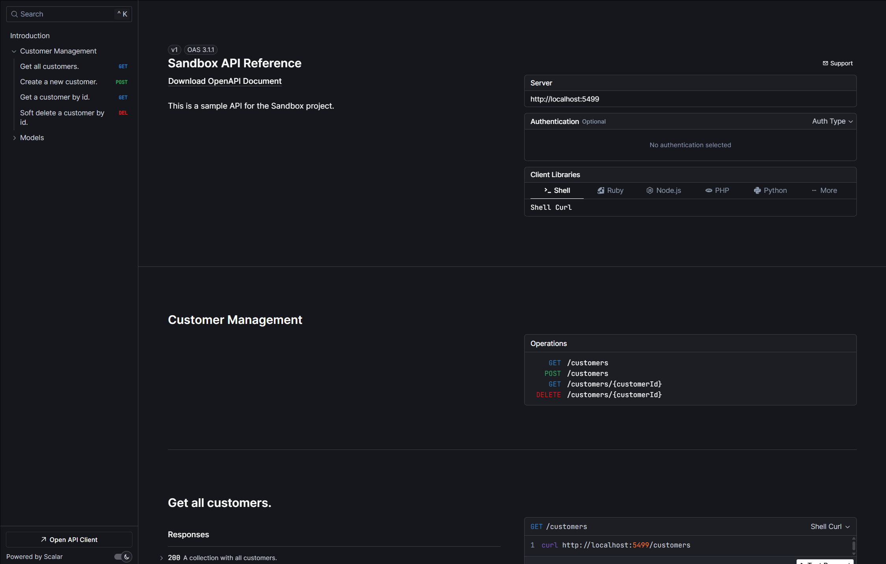

<div align="center">
  
  
# .NET and Angular Sandbox

[](https://github.com/codespaces/new?hide_repo_select=true&ref=main&repo=925777950)

</div>

Some buzzwords that are used:

- [Aspire](https://learn.microsoft.com/en-us/dotnet/aspire/get-started/aspire-overview)
- [.NET (Minimal) API](https://learn.microsoft.com/en-us/aspnet/core/fundamentals/minimal-apis/overview)
    - [EF Core](https://learn.microsoft.com/en-us/ef/core/) (with Migrations)
- [Angular](https://angular.dev/)
- [Redis](https://redis.io/) with [FusionCache](https://github.com/ZiggyCreatures/FusionCache) (distributed hybrid caching with backplane synchronization)
- [OpenTelemetry](https://opentelemetry.io/)
    - [Grafana](https://grafana.com/) Stack ([Tempo](https://grafana.com/docs/tempo/latest/), [Loki](https://grafana.com/docs/loki/latest/))
    - [Prometheus](https://prometheus.io/) (and [Blackbox](https://github.com/prometheus/blackbox_exporter))
- [YARP](https://learn.microsoft.com/en-us/aspnet/core/fundamentals/servers/yarp/getting-started)
- Containers
- [Azure Developer CLI](https://learn.microsoft.com/en-us/azure/developer/azure-developer-cli/) (azd)
- Authentication with [Keycloak](https://www.keycloak.org/)
- Secrets OPerationS ([SOPS](https://github.com/getsops/sops))
- [Renovate](https://docs.renovatebot.com/) for automatic dependency updates
- Testing
    - Angular tests with [Vitest](https://vitest.dev/)
    - .NET unit tests with [TUnit](https://tunit.dev/)
    - .NET integration tests with [Testcontainers](https://testcontainers.com/)
    - End-to-End Testing with [Playwright](https://playwright.dev/)



## Prerequisites

- [.NET 10](https://dotnet.microsoft.com/en-us/download)
- [`pnpm`](https://pnpm.io/)
- Containerization tool ([podman](https://podman.io/), [docker](https://www.docker.com/products/docker-desktop/), etc)

> [!NOTE]
> **Windows Long Path Support**
>
> Windows has a default path length limitation of 260 characters that may cause errors during Git operations with this repository (e.g., "Filename too long" errors). To enable long path support, run one of the following commands (see [git config core.longpaths](https://git-scm.com/docs/git-config#Documentation/git-config.txt-corelongpaths)):
>
> **System-wide (requires Administrator privileges):**
>
> ```bash
> git config --system core.longpaths true
> ```
>
> **User-level (no Administrator required):**
>
> ```bash
> git config --global core.longpaths true
> ```

## Secret Management with SOPS

The project uses [SOPS (Secrets Operations)](https://github.com/getsops/sops) to encrypt sensitive configuration values:

- **Encrypted Configuration**: `appsettings.encrypted.json` files contain encrypted secrets
- **Selective Encryption**: Only fields matching secret patterns (Secret, Password, Key, Token) are encrypted
- **Development Friendly**: Non-sensitive configuration remains in plain text for easy reading

### SOPS Quick Start

```powershell
$env:SOPS_AGE_KEY_FILE = "./config/sops/age/keys.txt"
sops --decrypt "config/appsettings.encrypted.json" > "Sandbox.AppHost/appsettings.json"
sops --encrypt "Sandbox.AppHost/appsettings.json" > "config/appsettings.encrypted.json"
```

## Run the project locally

Clone the project and run the `dotnet run` command in the root folder to start the project.

```bash
dotnet run --project ./Sandbox.AppHost
```

## Result

### Aspire dashboard

The Aspire dashboard provides a comprehensive view of all running services, their health status, and resource utilization in the development environment.



### Grafana Stack with OpenTelemetry data

The monitoring stack uses Grafana to visualize OpenTelemetry data collected from all services, providing insights into application performance, logs, traces, and health metrics.









### Authentication using Keycloak

Keycloak serves as the identity and access management solution, providing secure authentication and authorization for the application.



### OpenAPI Specification with Scalar

Scalar provides an interactive API documentation interface generated from the OpenAPI specification, allowing developers to explore and test API endpoints.



## Additional Resources

- [github/awesome-copilot](https://github.com/github/awesome-copilot/tree/main): A collection of custom instructions, agents, prompts, and skills for GitHub Copilot.

## Deploy to Azure

To deploy the project, make sure you have an Azure subscription and [`azd` installed](https://learn.microsoft.com/en-us/azure/developer/azure-developer-cli/install-azd?tabs=winget-windows%2Cbrew-mac%2Cscript-linux&pivots=os-windows).

Then, run the following commands to provision the resources and deploy the project:

```bash
azd init
azd up
```
