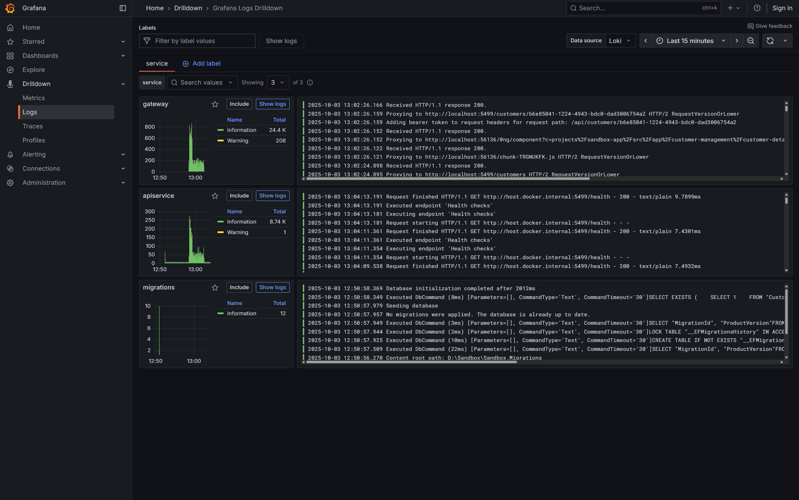

# .NET and Angular Sandbox

Some buzzwords that are used:

- Aspire
- .NET (Minimal) API
  - EF Core Migrations
- Angular
- OpenTelemetry
- YARP
- Containers
- Azure Developer CLI (azd)
- Authentication (WIP)

## Prerequisites

- [.NET 9](https://dotnet.microsoft.com/en-us/download)
- [`pnpm`](https://pnpm.io/) - `npnm` is also fine but you need to install the dependencies manually (go to the `Sandbox.AngularApp` folder and run `npm install`)
- Containerization tool ([podman](https://podman.io/), [docker](https://www.docker.com/products/docker-desktop/), etc)

## Run the project locally

Clone the project and run the `dotnet run` command in the root folder to start the project.

```bash
dotnet run --project .\Sandbox.AppHost
```

## Result

While the project runs you should see the Aspire dashboard.
The first time this can take a while to spin up the containers and download the images.

[](./other/dashboard.png)

Navigating to the gateway opens the Angular app, which invokes the .NET API.
Interacting with the application will generate traces that are sent to the Aspire dashboard, which can be looked at in real-time through the "Traces" tab in the dashboard.

[](./other/trace.png)

With the corresponding logs for the traces.

[](./other/logs.png)

## Deploy to Azure

To deploy the project, make sure you have an Azure subscription and [`azd` installed](https://learn.microsoft.com/en-us/azure/developer/azure-developer-cli/install-azd?tabs=winget-windows%2Cbrew-mac%2Cscript-linux&pivots=os-windows).

Then, run the following commands to provision the resources and deploy the project:

```bash
azd init
azd up
```
