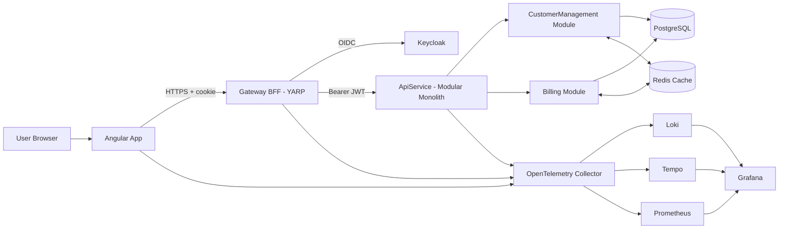

# Project Architecture Blueprint

Generated: 2026-02-26

## 1) Executive Summary

Sandbox is a monorepo that combines an Angular 21 frontend and a .NET 10 backend using a **BFF + modular monolith** architecture, orchestrated by **.NET Aspire**. The runtime topology is:

- **Edge/BFF**: `Sandbox.Gateway` (YARP reverse proxy + OIDC + anti-forgery)
- **Core API**: `Sandbox.ApiService` (modular monolith host)
- **Domain modules**: `Sandbox.Modules.CustomerManagement`, `Sandbox.Modules.Billing`
- **Infra**: PostgreSQL, Redis, Keycloak, OpenTelemetry collector, Grafana/Loki/Tempo/Prometheus
- **Frontend**: `Sandbox.AngularWorkspace`

The architecture prioritizes security (tokens never exposed to SPA), modular boundaries (`IModule` contract + per-module schema), and observability by default (`Sandbox.ServiceDefaults`).

---

## 2) Architecture Detection

### Technology Stack

- **Backend**: .NET 10, ASP.NET Core minimal APIs, EF Core, YARP, Wolverine
- **Frontend**: Angular 21 standalone style workspace
- **Data**: PostgreSQL (module schemas), Redis (distributed cache/backplane)
- **Security**: Keycloak (OIDC/OAuth2), cookie session at gateway, JWT at API
- **Orchestration**: .NET Aspire AppHost
- **Observability**: OpenTelemetry + Grafana stack (Loki, Tempo, Prometheus)
- **Testing**: TUnit (backend), Vitest (Angular), Playwright (e2e), ArchUnitNET (architecture tests)

### Primary Architecture Pattern

A **hybrid architecture**:

1. **BFF pattern** at the boundary (`Sandbox.Gateway`)
2. **Modular monolith** inside `Sandbox.ApiService`
3. **Layered module internals** (Domain/Application/Data)
4. **Distributed system runtime** via Aspire-managed dependencies

---

## 3) High-Level Blueprint (Container View)

---

## 4) Runtime Composition (Aspire AppHost)

`Sandbox.AppHost/AppHost.cs` is the operational blueprint. It wires:

- Identity (`AddKeycloak`)
- Data stores (`AddPostgres`, `AddRedis`)
- Observability resources (`AddOpenTelemetryCollector`, Loki/Tempo/Prometheus/Grafana)
- API and Gateway projects (`AddProject<...>()`)
- Frontend (`AddJavaScriptApp` with pnpm install/start)
- Migrations worker (`Sandbox.Migrations`) and startup ordering (`WaitFor`)
- Optional e2e resource for Playwright in development
- Optional Data API Builder container (`azure-databases/data-api-builder`)

### Startup Dependency Rules

- API waits for DB, migrations, Keycloak, Redis
- Gateway waits for API, Angular app, OTel collector, Keycloak
- Migrations runs before API traffic

This reduces race conditions during local/distributed startup.

---

## 5) Core Components and Responsibilities

## 5.1 Gateway (`Sandbox.Gateway`)

Primary responsibilities:

- Browser-facing auth session (cookie scheme + OIDC challenge)
- Reverse proxy to backend services (YARP)
- Security transforms:
    - anti-forgery token issuance/validation
    - cookie header stripping before upstream
    - bearer token forwarding for authorized routes
- Rate limiting (`user-or-ip` fixed window policy)

Key design decision: the gateway is the trust boundary where cookie auth is translated to API bearer access.

## 5.2 API Host (`Sandbox.ApiService`)

Primary responsibilities:

- Composes cross-cutting services via extension methods:
    - `AddSecurity`, `AddAuthentication`, `AddOpenApi`, `AddErrorHandling`, `AddCaching`, `AddWolverine`, `AddModules`
- Hosts module endpoints and middleware
- Applies secure headers and centralized exception handling

The API host intentionally avoids central domain logic; feature logic lives in modules.

## 5.3 Module System (`Sandbox.SharedKernel.Modules`)

`IModule` contract:

- `AddModule(WebApplicationBuilder)`
- `UseModule(WebApplication)`

`ModuleExtensions` discovers module implementations via reflection on `Sandbox.*.dll` and composes them at runtime.

Result: module add/remove is primarily assembly-driven, minimizing host changes.

## 5.4 CustomerManagement Module

Implemented in `Sandbox.Modules.CustomerManagement`:

- Registers its own `CustomerDbContext`
- Exposes `/customers` endpoints requiring authorization
- Uses hybrid cache APIs (`FusionCache`/`HybridCache` patterns)
- Owns domain model (`Customer`, addresses, value objects)

## 5.5 Billing Module

Implemented in `Sandbox.Modules.Billing`:

- Registers `BillingDbContext`
- Owns `billing` schema
- Currently lightweight but follows same module contract

---

## 6) Layering and Dependency Rules

## 6.1 Layer Model (per module)

- **Domain**: business state/rules/value objects
- **Application/Handlers**: use-case orchestration and endpoint handlers
- **Data**: EF Core mapping/persistence

## 6.2 Enforcement

`Sandbox.Architectural.Tests` uses ArchUnitNET to codify boundaries.

Example enforced rule: Domain types must not depend on Application/Data (except allowed low-level/system references).

This gives architecture governance as executable tests, not only documentation.

---

## 7) Data Architecture

## 7.1 Storage and Schema Ownership

- PostgreSQL is primary store
- Each module owns a distinct schema:
    - `customermanagement`
    - `billing`

`CustomerDbContext`/`BillingDbContext` inherit module base context and set `Schema` explicitly.

## 7.2 Domain Modeling Patterns

- Strongly typed IDs (shared kernel)
- Complex/owned properties for value objects (e.g., full name, address)
- Soft-delete support in domain contracts
- TPH discriminator for customer address variants (`Billing`/`Shipping`)

## 7.3 Caching Pattern

ADR-0001 documents accepted strategy:

- L1 in-memory + L2 Redis hybrid caching with FusionCache
- Cache tags and invalidation for customer query sets
- Resilience options (timeouts, fail-safe, jitter, circuit breaker)

---

## 8) Cross-Cutting Concerns

## 8.1 Authentication and Authorization

- Gateway: cookie-based user session, OIDC with Keycloak, token refresh capability
- API: JWT bearer validation with Keycloak realm/audience
- Default auth policies applied at gateway and endpoint groups

## 8.2 Security Hardening

- API security headers policy (CSP, frame deny, nosniff, etc.)
- Strict cookie settings in gateway
- Anti-forgery support (`X-XSRF-TOKEN`) for proxied requests

## 8.3 Error Handling and Problem Details

- API exception handler + RFC7807 problem details customization
- Gateway `UseExceptionHandler` + status code pages

## 8.4 Observability

Through `Sandbox.ServiceDefaults` and AppHost resources:

- OpenTelemetry logging, tracing, metrics
- Health and liveness endpoints in development
- OTLP exporter integration to collector
- Grafana stack for dashboards, logs, traces, metrics

---

## 9) Communication Patterns

- **Client → Gateway**: HTTPS, cookie-authenticated requests
- **Gateway → Keycloak**: OIDC/OAuth2 flows
- **Gateway → API**: proxied HTTPS with bearer token transform
- **API ↔ Redis**: cache reads/writes/backplane behavior
- **API → PostgreSQL**: EF Core/Npgsql data access
- **Services → OTel**: telemetry export via OTLP

Primary runtime pattern is synchronous HTTP request/response, with Wolverine available for durable/internal messaging concerns.

---

## 10) Testing Architecture

The project uses test types aligned to architectural levels:

- **Unit tests (.NET modules/services)**: TUnit
- **Architecture tests**: ArchUnitNET + TUnit (`Sandbox.Architectural.Tests`)
- **Integration tests**: dedicated backend integration projects
- **Frontend tests**: Vitest in Angular workspace
- **End-to-end tests**: Playwright (`Sandbox.EndToEndTests`)

This provides layered confidence: design rules, behavior, integration, and user-flow validation.

---

## 11) Deployment Blueprint

## 11.1 Development Topology

Aspire runs the distributed application locally with managed dependencies and dashboard.

Canonical command:

- `dotnet run --project ./Sandbox.AppHost`

## 11.2 Cloud Trajectory

Repository already includes Azure deployment paths (`azure.yaml`, azd instructions), so architecture is aligned for local-to-cloud parity.

## 11.3 Configuration and Secrets

- Environment-based appsettings
- SOPS encrypted config (`config/appsettings.encrypted.json`)
- Secret fields encrypted by naming patterns

---

## 12) Extension Blueprint for New Development

## 12.1 Adding a New Domain Module

1. Create new `Sandbox.Modules.<Domain>` assembly
2. Implement `IModule` (`AddModule`, `UseModule`)
3. Add module-specific DbContext and schema ownership
4. Add endpoint group(s) under module boundary
5. Add cache strategy where read-heavy
6. Add tests:
    - unit tests for domain/application
    - architecture rule updates if needed
    - integration tests for persistence/API behavior

No central registration is required if assembly naming/discovery conventions are preserved.

## 12.2 Adding New Endpoints in Existing Module

- Place endpoint handler in module Application/Handlers area
- Keep transport concerns at endpoint edge; domain rules in Domain/Application
- Reuse keyed cache invalidation strategy where list/detail reads are affected
- Ensure endpoint authorization and problem detail behaviors remain consistent

## 12.3 Adding External Integrations

- Prefer adapter boundary inside module or shared infrastructure package
- Keep integration-specific contracts outside domain core
- Instrument all integration calls with OTel spans/metrics

---

## 13) Governance and Maintenance

- Architecture tests are the primary automated governance mechanism
- ADRs (`docs/adrs`) capture long-lived design decisions
- C4 diagrams (`docs/c4`) provide consistent visualization layers

Recommended maintenance cadence:

- Update this blueprint when:
    - a new module is added
    - trust boundaries/security flows change
    - data topology or cache strategy changes
    - observability stack or deployment model changes

---

## 14) Risks and Watchpoints

- Reflection-based module discovery requires stable assembly naming
- Hybrid caching requires disciplined invalidation and key conventions
- BFF token/cookie flow complexity should be covered by integration/e2e tests
- Multi-service startup order assumptions should remain encoded in AppHost `WaitFor` relations

---

## 15) Quick Reference

- Start stack: `dotnet run --project ./Sandbox.AppHost`
- Backend tests: `dotnet test`
- Frontend tests: `pnpm --filter="sandbox.angular-workspace" test --watch=false --reporters=dot`
- E2E tests: `pnpm --filter="sandbox.e2e" test --reporter=dot`
- Architecture diagrams: `docs/c4/`
- ADRs: `docs/adrs/`
