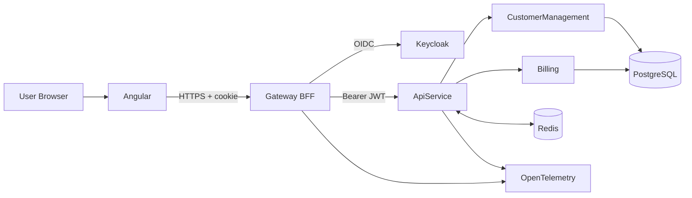

# Sandbox Architecture One-Pager

Audience: New team members and contributors

Primary reference: [Project Architecture Blueprint](./Project_Architecture_Blueprint.md)

## Purpose

Sandbox is a secure, observable, modular monolith platform with an Angular frontend and .NET backend, orchestrated through Aspire.

## At a Glance

- Frontend: Angular 21 (`Sandbox.AngularWorkspace`)
- Edge: BFF gateway with YARP (`Sandbox.Gateway`)
- Core API: Modular monolith host (`Sandbox.ApiService`)
- Domain modules: `CustomerManagement`, `Billing`
- Data: PostgreSQL (module-owned schemas) + Redis (hybrid caching)
- Identity: Keycloak (OIDC/OAuth2)
- Observability: OpenTelemetry + Grafana/Loki/Tempo/Prometheus

## Request Flow

## Core Architectural Rules

- Tokens stay server-side in the BFF flow; browser uses secure HttpOnly cookies.
- Modules implement `IModule` and are discovered/registered by the API host.
- Each module owns its schema (`customermanagement`, `billing`) and boundaries.
- Caching follows ADR-0001: FusionCache L1 + Redis L2.
- Architecture constraints are enforced by ArchUnitNET tests.

## Development Workflow

- Start full stack: `dotnet run --project ./Sandbox.AppHost`
- Add feature in existing module:
    1. Domain + Application logic
    2. Endpoint mapping in module
    3. Data mapping/query updates
    4. Cache invalidation where needed
    5. Unit/integration tests
- Add new module:
    1. New `Sandbox.Modules.<Name>` project
    2. Implement `IModule`
    3. Add module DbContext + schema
    4. Add tests + architecture rules as needed

## Where to Read Next

- Full blueprint: [Project_Architecture_Blueprint.md](./Project_Architecture_Blueprint.md)
- C4 diagrams: [docs/c4](./c4)
- ADRs: [docs/adrs](./adrs)
- Top-level setup and commands: [README.md](../README.md)
