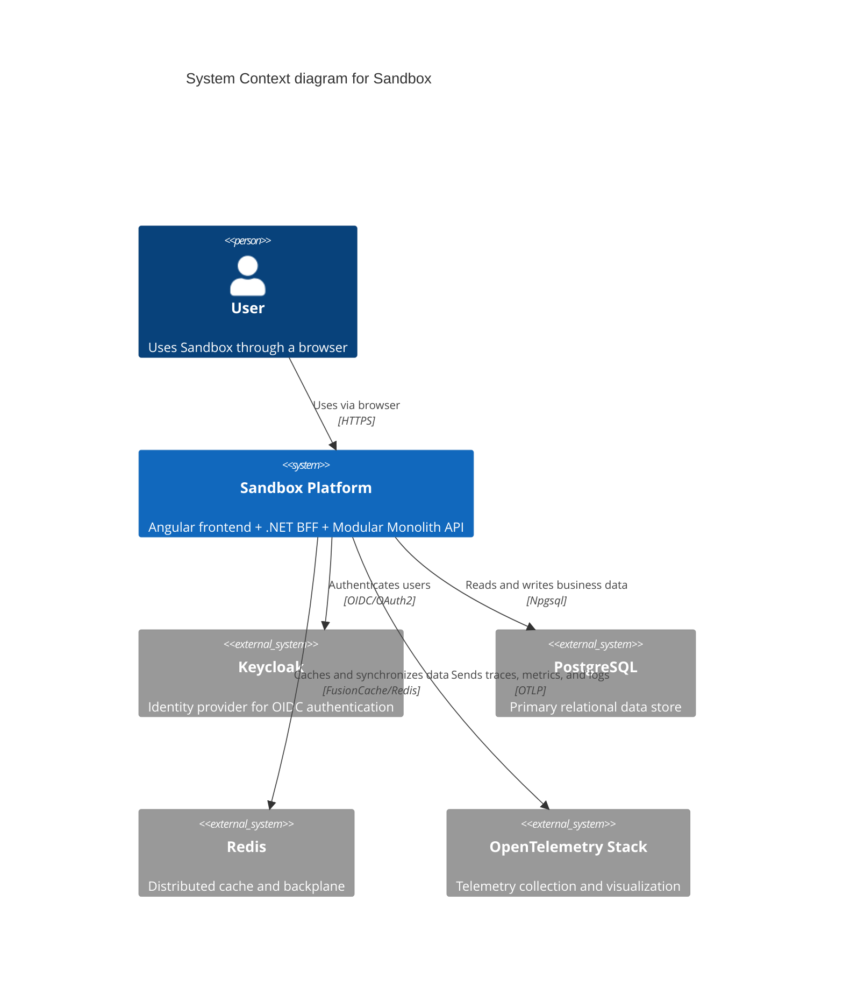

# C4 Level 1 - System Context

```mermaid
C4Context
  title System Context diagram for Sandbox

  Person(user, "User", "Uses Sandbox through a browser")
  System(sandbox, "Sandbox Platform", "Angular frontend + .NET BFF + Modular Monolith API")

  System_Ext(keycloak, "Keycloak", "Identity provider for OIDC authentication")
  System_Ext(pg, "PostgreSQL", "Primary relational data store")
  System_Ext(redis, "Redis", "Distributed cache and backplane")
  System_Ext(otel, "OpenTelemetry Stack", "Telemetry collection and visualization")

  Rel(user, sandbox, "Uses via browser", "HTTPS")
  Rel(sandbox, keycloak, "Authenticates users", "OIDC/OAuth2")
  Rel(sandbox, pg, "Reads and writes business data", "Npgsql")
  Rel(sandbox, redis, "Caches and synchronizes data", "FusionCache/Redis")
  Rel(sandbox, otel, "Sends traces, metrics, and logs", "OTLP")
```
