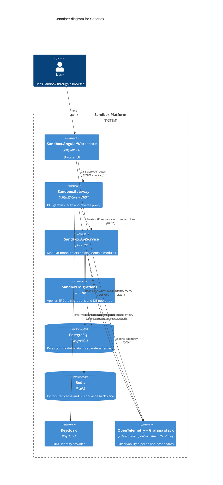

# C4 Level 2 - Container Diagram

```mermaid
C4Container
  title Container diagram for Sandbox

  Person(user, "User", "Uses Sandbox through a browser")

  System_Boundary(sandbox, "Sandbox Platform") {
    Container(angular, "Sandbox.AngularWorkspace", "Angular 21", "Browser UI")
    Container(gateway, "Sandbox.Gateway", "ASP.NET Core + YARP", "BFF gateway, auth and reverse proxy")
    Container(api, "Sandbox.ApiService", ".NET 10", "Modular monolith API hosting domain modules")
    Container(migrations, "Sandbox.Migrations", ".NET 10", "Applies EF Core migrations and DB bootstrap")
    ContainerDb(postgres, "PostgreSQL", "PostgreSQL", "Persistent module data in separate schemas")
    ContainerDb(redis, "Redis", "Redis", "Distributed cache and FusionCache backplane")
    Container(identity, "Keycloak", "Keycloak", "OIDC identity provider")
    Container(otel, "OpenTelemetry + Grafana stack", "OTel/Loki/Tempo/Prometheus/Grafana", "Observability pipeline and dashboards")
  }

  Rel(user, angular, "Uses", "HTTPS")
  Rel(angular, gateway, "Calls app/API routes", "HTTPS + cookies")
  Rel(gateway, identity, "Performs login and token refresh", "OIDC/OAuth2")
  Rel(gateway, api, "Proxies API requests with bearer token", "HTTPS")
  Rel(api, postgres, "Reads and writes module data", "Npgsql")
  Rel(api, redis, "Reads and writes cache entries", "FusionCache + StackExchange.Redis")
  Rel(migrations, postgres, "Applies migrations", "EF Core")
  Rel(gateway, otel, "Exports telemetry", "OTLP")
  Rel(api, otel, "Exports telemetry", "OTLP")
  Rel(angular, otel, "Exports telemetry", "OTLP")
```
