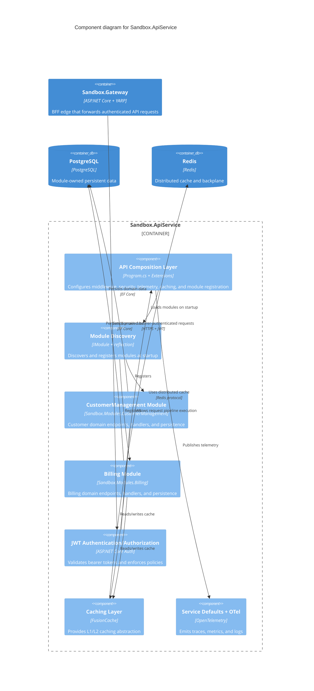

# C4 Level 3 - Component Diagram (Sandbox.ApiService)

```mermaid
C4Component
  title Component diagram for Sandbox.ApiService

  Container(gateway, "Sandbox.Gateway", "ASP.NET Core + YARP", "BFF edge that forwards authenticated API requests")
  ContainerDb(postgres, "PostgreSQL", "PostgreSQL", "Module-owned persistent data")
  ContainerDb(redis, "Redis", "Redis", "Distributed cache and backplane")

  Container_Boundary(apiService, "Sandbox.ApiService") {
    Component(apiComposition, "API Composition Layer", "Program.cs + Extensions", "Configures middleware, security, telemetry, caching, and module registration")
    Component(moduleLoader, "Module Discovery", "IModule + reflection", "Discovers and registers modules at startup")
    Component(customerModule, "CustomerManagement Module", "Sandbox.Modules.CustomerManagement", "Customer domain endpoints, handlers, and persistence")
    Component(billingModule, "Billing Module", "Sandbox.Modules.Billing", "Billing domain endpoints, handlers, and persistence")
    Component(authz, "JWT Authentication/Authorization", "ASP.NET Core Auth", "Validates bearer tokens and enforces policies")
    Component(cacheLayer, "Caching Layer", "FusionCache", "Provides L1/L2 caching abstraction")
    Component(observability, "Service Defaults + OTel", "OpenTelemetry", "Emits traces, metrics, and logs")
  }

  Rel(gateway, authz, "Sends proxied bearer-authenticated requests", "HTTPS + JWT")
  Rel(authz, apiComposition, "Allows request pipeline execution")
  Rel(apiComposition, moduleLoader, "Loads modules on startup")
  Rel(moduleLoader, customerModule, "Registers")
  Rel(moduleLoader, billingModule, "Registers")
  Rel(customerModule, cacheLayer, "Reads/writes cache")
  Rel(billingModule, cacheLayer, "Reads/writes cache")
  Rel(customerModule, postgres, "Persists domain data", "EF Core")
  Rel(billingModule, postgres, "Persists domain data", "EF Core")
  Rel(cacheLayer, redis, "Uses distributed cache", "Redis protocol")
  Rel(apiComposition, observability, "Publishes telemetry")
```
