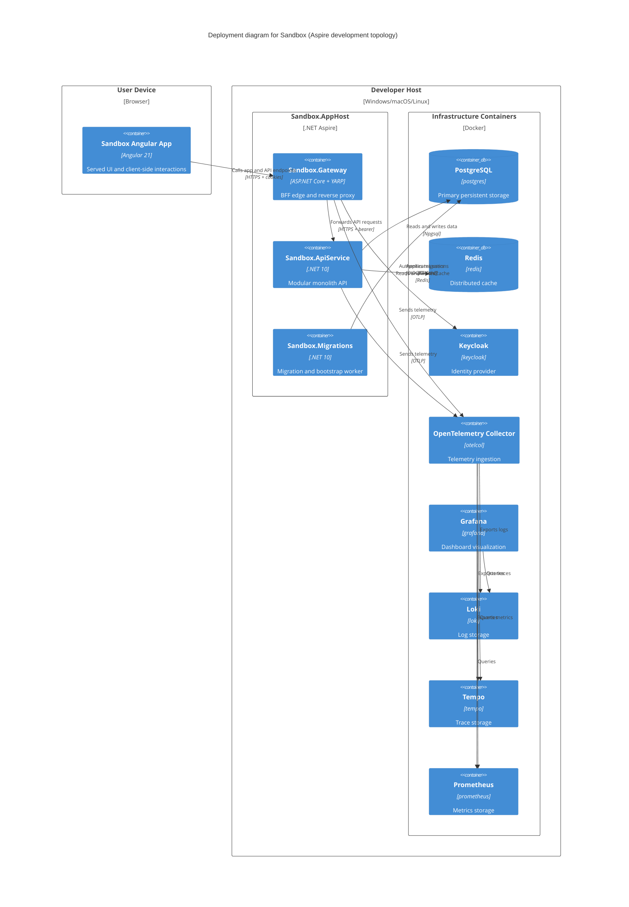

# C4 Level 4 - Deployment Diagram

```mermaid
C4Deployment
  title Deployment diagram for Sandbox (Aspire development topology)

  Deployment_Node(userDevice, "User Device", "Browser") {
    Container(browserApp, "Sandbox Angular App", "Angular 21", "Served UI and client-side interactions")
  }

  Deployment_Node(localHost, "Developer Host", "Windows/macOS/Linux") {
    Deployment_Node(aspire, "Sandbox.AppHost", ".NET Aspire") {
      Container(gateway, "Sandbox.Gateway", "ASP.NET Core + YARP", "BFF edge and reverse proxy")
      Container(api, "Sandbox.ApiService", ".NET 10", "Modular monolith API")
      Container(migrations, "Sandbox.Migrations", ".NET 10", "Migration and bootstrap worker")
    }

    Deployment_Node(infra, "Infrastructure Containers", "Docker") {
      ContainerDb(postgres, "PostgreSQL", "postgres", "Primary persistent storage")
      ContainerDb(redis, "Redis", "redis", "Distributed cache")
      Container(keycloak, "Keycloak", "keycloak", "Identity provider")
      Container(otel, "OpenTelemetry Collector", "otelcol", "Telemetry ingestion")
      Container(grafana, "Grafana", "grafana", "Dashboard visualization")
      Container(loki, "Loki", "loki", "Log storage")
      Container(tempo, "Tempo", "tempo", "Trace storage")
      Container(prom, "Prometheus", "prometheus", "Metrics storage")
    }
  }

  Rel(browserApp, gateway, "Calls app and API endpoints", "HTTPS + cookies")
  Rel(gateway, keycloak, "Authenticates users", "OIDC/OAuth2")
  Rel(gateway, api, "Forwards API requests", "HTTPS + bearer")
  Rel(api, postgres, "Reads and writes data", "Npgsql")
  Rel(api, redis, "Reads and writes cache", "Redis")
  Rel(migrations, postgres, "Applies migrations", "EF Core")
  Rel(gateway, otel, "Sends telemetry", "OTLP")
  Rel(api, otel, "Sends telemetry", "OTLP")
  Rel(otel, loki, "Exports logs")
  Rel(otel, tempo, "Exports traces")
  Rel(otel, prom, "Exports metrics")
  Rel(grafana, loki, "Queries")
  Rel(grafana, tempo, "Queries")
  Rel(grafana, prom, "Queries")
```
